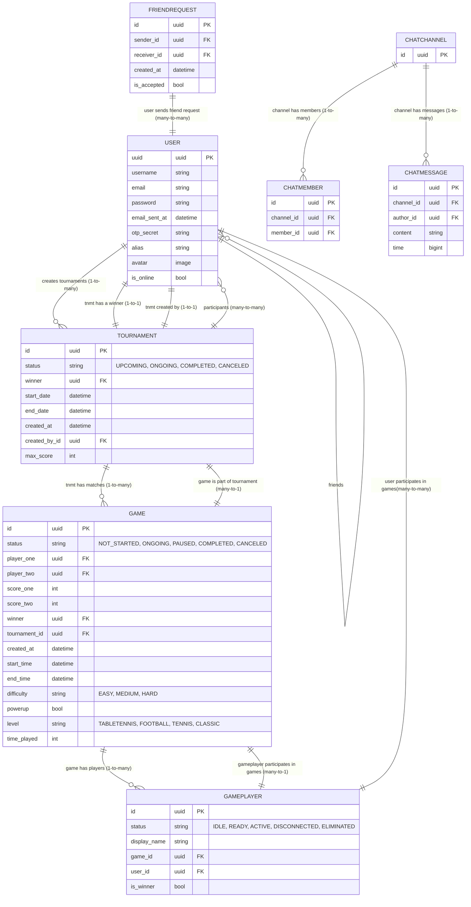

```mermaid
%%{init: {
  "theme": "default",
  "themeCSS": [
    ".er.relationshipLabel { fill: black; }",
    ".er.relationshipLabelBox { fill: cyan; }",
    ".er.entityBox { fill: lightgray; }",
    "[id^=entity-TOURNAMENT] .er.entityBox { fill: lightgreen;} ",
    "[id^=entity-GAME] .er.entityBox { fill: powderblue;} ",
    "[id^=entity-USER] .er.entityBox { fill: pink;} "
  ]
}}%%
erDiagram

    USER ||--o{ TOURNAMENT : "creates tournaments (1-to-many)"
                           
    TOURNAMENT {
        id uuid PK
        status string "UPCOMING, ONGOING, COMPLETED, CANCELED"
        winner uuid FK
        start_date datetime
        end_date datetime
        created_at datetime
        created_by_id uuid FK
        max_score int
    }
    TOURNAMENT ||--o{ GAME : "tnmt has matches (1-to-many)"
    TOURNAMENT ||--|| USER : "tnmt has a winner (1-to-1)"
    TOURNAMENT ||--|| USER : "tnmt created by (1-to-1)"
    TOURNAMENT ||--o{ USER : "participants (many-to-many)"

    GAME {
        id uuid PK
        status string "NOT_STARTED, ONGOING, PAUSED, COMPLETED, CANCELED"
        player_one uuid FK
        player_two uuid FK
        score_one int
        score_two int
        winner uuid FK
        tournament_id uuid FK
        created_at datetime
        start_time datetime
        end_time datetime
        difficulty string "EASY, MEDIUM, HARD"
        powerup bool
        level string "TABLETENNIS, FOOTBALL, TENNIS, CLASSIC"
        time_played int
    }
    GAME ||--o{ GAMEPLAYER : "game has players (1-to-many)"
    GAME ||--|| TOURNAMENT : "game is part of tournament (many-to-1)"

    GAMEPLAYER {
        id uuid PK
        status string "IDLE, READY, ACTIVE, DISCONNECTED, ELIMINATED"
        display_name string
        game_id uuid FK
        user_id uuid FK
        is_winner bool
    }
    GAMEPLAYER ||--|| GAME : "gameplayer participates in games (many-to-1)"
    GAMEPLAYER ||--|| USER : "user participates in games(many-to-many)"

    USER {
        uuid uuid PK
        username string
        email string
        password string
        email_sent_at datetime
        otp_secret string
        alias string
        avatar image
        is_online bool
    }
    USER ||--o{ USER : friends

    FRIENDREQUEST {
        id uuid PK
        sender_id uuid FK
        receiver_id uuid FK
        created_at datetime
        is_accepted bool
    }
    FRIENDREQUEST ||--|| USER : "user sends friend request (many-to-many)"

    CHATCHANNEL ||--o{ CHATMEMBER : "channel has members (1-to-many)"
    CHATCHANNEL ||--o{ CHATMESSAGE : "channel has messages (1-to-many)"
    CHATCHANNEL {
        id uuid PK
    }

    CHATMEMBER {
        id uuid PK
        channel_id uuid FK
        member_id uuid FK
    }

    CHATMESSAGE {
        id uuid PK
        channel_id uuid FK
        author_id uuid FK
        content string
        time bigint
    }
```
